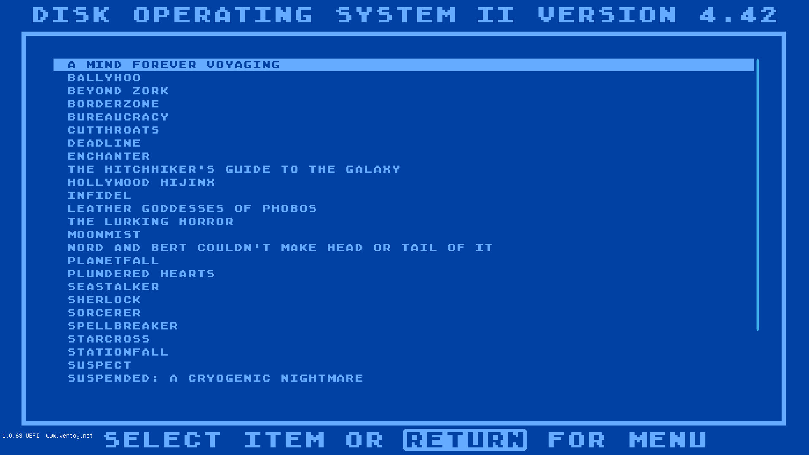

# IF UEFI USB
You need a small USB3 flash drive, at least 1GB in size.  These instructions are for Windows 10, chances are if you use Linux you can figure out what needs to be done

Download [Ventoy](https://github.com/ventoy/Ventoy/releases/)

Go to Options -> Partition Configuration

Preserve half the drive I'm using a 32GB drive

Now install ventoy

Now start Disk Management in Windows, right click Unallocated section of drive and select New Simple Volume

Format with the following

Now copy the files, files inside the exFAT folder goes on root the 1st partition, files in the FAT32 folder go on root the 3rd partition (the one you just made)

That it, boot PC with drive

